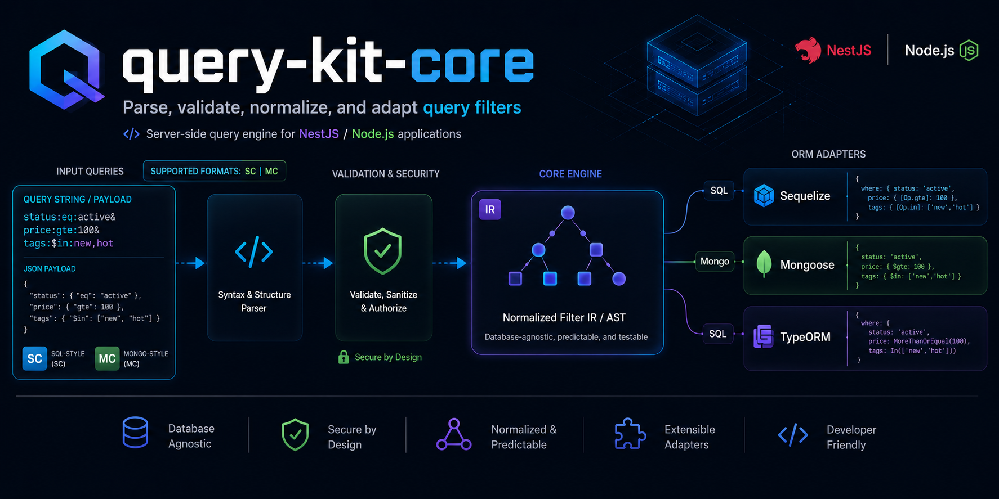

# query-kit-core

`query-kit-core` is the server-side package in the Query Kit family.

Related package:

- `query-kit-encoder` — frontend-side companion package for building query
  strings and payloads compatible with `query-kit-core`

It accepts filter payloads and query strings, parses them, validates them,
normalizes them into a neutral filter IR, and converts that IR into ORM-native
query structures for:

- `Sequelize`
- `Mongoose`
- `TypeORM`

This package is for backend/runtime use. Frontend apps can use
`query-kit-encoder` to construct query strings and payloads, while
`query-kit-core` is the package that parses, validates, normalizes, and applies
them on the server.

---

## Table of contents

- [What this package does](#what-this-package-does)
- [Installation](#installation)
- [Quick start](#quick-start)
- [NestJS setup](#nestjs-setup)
- [Manual setup without NestJS](#manual-setup-without-nestjs)
- [Core concepts](#core-concepts)
- [Main processing API](#main-processing-api)
- [Type And Option Reference](#type-and-option-reference)
- [Query object shape](#query-object-shape)
- [Built-in formats](#built-in-formats)
- [SC format reference](#sc-format-reference)
- [MC format reference](#mc-format-reference)
- [Directives](#directives)
- [Operator reference](#operator-reference)
- [Validation](#validation)
- [Policy layer](#policy-layer)
- [Relations and include/populate](#relations-and-includepopulate)
- [Aggregation](#aggregation)
- [CASE expressions](#case-expressions)
- [Adapter reference](#adapter-reference)
- [Adapter cookbook](#adapter-cookbook)
- [Audit mode](#audit-mode)
- [Custom operators and extension points](#custom-operators-and-extension-points)
- [Public exports](#public-exports)
- [Limitations and compatibility notes](#limitations-and-compatibility-notes)
- [Troubleshooting](#troubleshooting)

---

## What this package does

`query-kit-core` solves the backend half of filter/query handling:

1. Accept a filter string or structured query object.
2. Parse one of the built-in formats:
   - `scfilter`
   - `mcfilter`
3. Optionally validate it against:
   - field schemas
   - operator rules
   - value constraints
   - role-based access rules
   - runtime policies
4. Convert it into a neutral filter IR.
5. Convert the IR into an ORM-native query structure.

Built-in feature coverage:

- `SC` format (`field:operator:value`)
- `MC` format (`field:$operator:value`)
- logical expressions in `SC`
- field selection
- sorting
- pagination
- relation loading
- aggregation
- `HAVING`
- `CASE` expressions in `SC`
- validation for both built-in formats
- policy enforcement
- capability checks
- audit/diagnostic mode
- custom operator extension APIs

### Query Kit package roles

- `query-kit-core`
  - backend/runtime package
  - parses and validates incoming filter input
  - normalizes queries into filter IR
  - converts filter IR into Sequelize, Mongoose, or TypeORM query structures
- `query-kit-encoder`
  - frontend/client package
  - builds `SC` and `MC` query strings
  - builds payload objects and URL query parameters
  - helps frontend developers generate requests compatible with `query-kit-core`

---

## Installation

Install the package:

```bash
pnpm add query-kit-core
```

```bash
npm install query-kit-core
```

If you also want the frontend-side companion package:

```bash
pnpm add query-kit-encoder
```

```bash
npm install query-kit-encoder
```

Install the runtime libraries your app actually uses:

- Sequelize apps:

```bash
pnpm add sequelize
```

```bash
npm install sequelize
```

- Mongoose apps:

```bash
pnpm add mongoose
```

```bash
npm install mongoose
```

- TypeORM apps:

```bash
pnpm add typeorm
```

```bash
npm install typeorm
```

If you use NestJS, your app should already have:

- `@nestjs/common`
- `@nestjs/core`

---

## Quick start

### Standalone `SC` + Sequelize example

```ts
import {
  FilterProcessor,
  FilterRegistry,
  SCFormat,
  SCFormatValidator,
  SequelizeAdapter,
} from 'query-kit-core';

const registry = new FilterRegistry();

registry.registerFormatRegistration({
  format: new SCFormat(),
  validator: new SCFormatValidator(),
});

registry.registerAdapter(new SequelizeAdapter());

const processor = new FilterProcessor(registry, {
  defaultFormat: 'scfilter',
  defaultOrm: 'sequelize',
  enableValidation: true,
});

const result = processor.processWith({
  query: 'status:eq:active;price:between:100,200;brand:eq:nike;@sort:-createdAt;@limit:20',
  adapterOptions: {
    model: ProductModel,
    dialect: 'postgres',
  },
  pipeline: {
    validate: true,
    schema: {
      status: { type: 'string' },
      price: { type: 'number' },
      createdAt: { type: 'date' },
    },
  },
});
```

### Standalone `MC` + Mongoose example

```ts
import {
  FilterProcessor,
  FilterRegistry,
  MCFormat,
  MCFormatValidator,
  MongooseAdapter,
} from 'query-kit-core';

const registry = new FilterRegistry();

registry.registerFormatRegistration({
  format: new MCFormat(),
  validator: new MCFormatValidator(),
});

registry.registerAdapter(new MongooseAdapter());

const processor = new FilterProcessor(registry, {
  defaultFormat: 'mcfilter',
  defaultOrm: 'mongoose',
  enableValidation: true,
});

const result = processor.processWith({
  query: 'status:$eq:active;tags:$in:new,hot;category.name:$eq:electronics;@limit:10',
  adapterOptions: {
    model: ProductModel,
  },
  pipeline: {
    validate: true,
    schema: {
      status: { type: 'string' },
      tags: { type: 'array' },
    },
  },
});
```

---

## NestJS setup

`FilterModule` is the built-in Nest integration.

```ts
import { Module } from '@nestjs/common';
import { FilterModule } from 'query-kit-core';

@Module({
  imports: [
    FilterModule.forRoot({
      defaultFormat: 'scfilter',
      defaultOrm: 'sequelize',
      enableValidation: true,
      validationOptions: {
        strictMode: true,
        allowNestedFields: true,
        allowRelations: true,
        maxConditions: 50,
        maxValueLength: 1000,
      },
      mcValidationOptions: {
        strictMode: true,
        allowNestedFields: true,
        allowObjectOperators: false,
        maxConditions: 50,
        maxValueLength: 2000,
      },
      policy: {
        maxExpressionDepth: 4,
        maxJoins: 6,
        maxArrayLength: 50,
        denyExpensiveOperatorsOnPublicEndpoints: true,
      },
    }),
  ],
})
export class AppModule {}
```

Inject and use `FilterProcessor`:

```ts
import { Injectable } from '@nestjs/common';
import { FilterProcessor } from 'query-kit-core';

@Injectable()
export class ProductsService {
  constructor(private readonly filterProcessor: FilterProcessor) {}

  buildQuery(filterString: string) {
    return this.filterProcessor.processWith({
      query: {
        filterString,
        page: 1,
        size: 20,
      },
      adapterOptions: {
        model: ProductModel,
        dialect: 'postgres',
      },
      pipeline: {
        validate: true,
        schema: {
          status: { type: 'string' },
          price: { type: 'number' },
          createdAt: { type: 'date' },
        },
      },
    });
  }
}
```

### `FilterModule.forRoot()` options

`FilterModuleOptions` extends runtime options and adds validator defaults:

```ts
type FilterModuleOptions = {
  defaultFormat?: string;
  defaultOrm?: string;
  enableValidation?: boolean;
  policy?: FilterPolicyOptions;
  validationOptions?: ValidationOptions;
  mcValidationOptions?: MongoValidationOptions;
};
```

Meaning of each option:

- `defaultFormat`
  - default format when `processWith()` does not explicitly provide one
  - built-in values:
    - `scfilter`
    - `mcfilter`
- `defaultOrm`
  - default adapter when `processWith()` does not explicitly provide one
  - built-in values:
    - `sequelize`
    - `mongoose`
    - `typeorm`
- `enableValidation`
  - turns validation on by default
- `policy`
  - runtime security/performance controls
- `validationOptions`
  - default options for `SCFormatValidator`
- `mcValidationOptions`
  - default options for `MCFormatValidator`

Important: `FilterModule` only sets defaults. Per-request `schema` and
adapter-specific options still belong to each call.

---

## Manual setup without NestJS

If you do not use Nest, create the registry and processor directly:

```ts
const registry = new FilterRegistry();

registry.registerFormatRegistration({
  format: new SCFormat(),
  validator: new SCFormatValidator(),
});

registry.registerAdapter(new SequelizeAdapter());

const processor = new FilterProcessor(registry, {
  defaultFormat: 'scfilter',
  defaultOrm: 'sequelize',
  enableValidation: true,
});
```

---

## Core concepts

### Format

A format parses user syntax into a neutral filter IR.

Built-in formats:

- `SCFormat` → `scfilter`
- `MCFormat` → `mcfilter`

### Validator

A validator checks:

- field names
- operator validity
- value types
- schema rules
- role-based access

Built-in validators:

- `SCFormatValidator`
- `MCFormatValidator`

### Neutral filter IR

Both formats normalize into `FilterIR`. Adapters consume this IR instead of
re-parsing query strings.

### Adapter

An adapter converts `FilterIR` into ORM-native query structures.

Built-in adapters:

- `SequelizeAdapter`
- `MongooseAdapter`
- `TypeOrmAdapter`

---

## Main processing API

`FilterProcessor` is the main orchestration service.

### `process()`

Shorthand for explicit format and explicit adapter:

```ts
processor.process(
  'status:eq:active;@limit:10',
  'scfilter',
  'sequelize',
  {
    model: ProductModel,
    dialect: 'postgres',
  },
);
```

### `processWith()`

The most flexible API:

```ts
processor.processWith({
  query: 'status:eq:active',
  formatName: 'scfilter',
  ormName: 'sequelize',
  adapterOptions: {
    model: ProductModel,
    dialect: 'postgres',
  },
  pipeline: {
    validate: true,
    schema: {
      status: { type: 'string' },
    },
  },
});
```

Return value depends on the selected adapter. For Sequelize and Mongoose this
is the adapter-produced query object or query builder, while for TypeORM the
adapter returns the same query builder instance after mutating it. In TypeORM
flows, you still need to execute the builder yourself, for example with
`.getManyAndCount()` or `.getMany()`.

### Request structure

```ts
type FilterProcessRequest = {
  query: string | Query;
  formatName?: string;
  ormName?: string;
  adapterOptions?: unknown;
  pipeline?: {
    validate?: boolean;
    schema?: unknown;
    validationContext?: unknown;
    policy?: FilterPolicyOptions;
  };
};
```

### Runtime defaults

```ts
type FilterRuntimeOptions = {
  defaultFormat?: string;
  defaultOrm?: string;
  enableValidation?: boolean;
  policy?: FilterPolicyOptions;
};
```

---

## Type And Option Reference

This section documents the public option-bearing types that shape runtime
behavior, validation, adapter selection, and NestJS integration.

### Query

```ts
type Query = {
  filterString: string;
  sortString?: string;
  page?: number;
  size?: number;
  offset?: number;
  fields?: string[];
  relations?: RelationDirective;
  customInclude?: RelationDirective;
};
```

Field reference:

| Field | Required | What it does |
| --- | --- | --- |
| `filterString` | Yes | The main SC or MC filter payload. |
| `sortString` | No | External sort syntax when you do not want inline `@sort`. |
| `page` | No | Page number used for offset calculation when `offset` is not provided. |
| `size` | No | Page size alias used by some payload builders and clients. |
| `offset` | No | Direct offset override. Takes precedence over `page`. |
| `fields` | No | Projection fields requested by the client. |
| `relations` | No | Relation directives that map to include/populate/join behavior. |
| `customInclude` | No | Alternate relation/include directive used by the builder layer. |

### FilterProcessRequest

```ts
type FilterProcessRequest = {
  query: string | Query;
  formatName?: string;
  ormName?: string;
  adapterOptions?: unknown;
  pipeline?: {
    validate?: boolean;
    schema?: unknown;
    validationContext?: unknown;
    policy?: FilterPolicyOptions;
  };
};
```

Field reference:

| Field | Required | What it does |
| --- | --- | --- |
| `query` | Yes | Input query as a raw filter string or structured `Query` object. |
| `formatName` | No | Selects the registered format, for example `scfilter` or `mcfilter`. |
| `ormName` | No | Selects the registered adapter, for example `sequelize`, `mongoose`, or `typeorm`. |
| `adapterOptions` | No | Adapter-specific options passed to the selected adapter. |
| `pipeline` | No | Runtime validation and policy controls for this request. |

Pipeline options:

| Field | Required | What it does |
| --- | --- | --- |
| `validate` | No | Enables request-time validation for the incoming query. |
| `schema` | No | Format-specific field schema passed into the validator. |
| `validationContext` | No | Extra context used by field-access and policy rules. |
| `policy` | No | Request-level policy override applied before the adapter runs. |

### FilterRuntimeOptions

```ts
type FilterRuntimeOptions = {
  defaultFormat?: string;
  defaultOrm?: string;
  enableValidation?: boolean;
  policy?: FilterPolicyOptions;
};
```

| Field | Required | What it does |
| --- | --- | --- |
| `defaultFormat` | No | Default format used when `processWith()` omits `formatName`. |
| `defaultOrm` | No | Default adapter used when `processWith()` omits `ormName`. |
| `enableValidation` | No | Turns validation on by default for processor calls. |
| `policy` | No | Global runtime policy applied unless overridden per request. |

### FilterPolicyOptions

```ts
type FilterPolicyOptions = {
  maxExpressionDepth?: number;
  maxRelationDepth?: number;
  maxJoins?: number;
  maxPopulates?: number;
  maxArrayLength?: number;
  regex?: RegexComplexityPolicy;
  denyExpensiveOperatorsOnPublicEndpoints?: boolean;
  expensiveOperators?: string[];
};
```

| Field | Required | What it does |
| --- | --- | --- |
| `maxExpressionDepth` | No | Limits nested logical expression depth. |
| `maxRelationDepth` | No | Limits nesting depth for relations / includes / populates. |
| `maxJoins` | No | Caps join count for SQL adapters. |
| `maxPopulates` | No | Caps populate count for document adapters. |
| `maxArrayLength` | No | Caps array input size for operators like `in`, `any`, and `all`. |
| `regex` | No | Adds regex-specific safety limits. |
| `denyExpensiveOperatorsOnPublicEndpoints` | No | Blocks expensive operators on public endpoints when policy context marks the endpoint as public. |
| `expensiveOperators` | No | Declares which operators should be treated as expensive by policy checks. |

### RegexComplexityPolicy

```ts
type RegexComplexityPolicy = {
  maxLength?: number;
  maxGroupCount?: number;
  maxAlternationCount?: number;
  maxQuantifierCount?: number;
  maxComplexityScore?: number;
  denyNestedQuantifiers?: boolean;
};
```

| Field | Required | What it does |
| --- | --- | --- |
| `maxLength` | No | Maximum allowed regex length. |
| `maxGroupCount` | No | Maximum number of capture or non-capture groups. |
| `maxAlternationCount` | No | Maximum number of alternations. |
| `maxQuantifierCount` | No | Maximum number of quantifiers. |
| `maxComplexityScore` | No | Upper bound for the computed regex complexity score. |
| `denyNestedQuantifiers` | No | Rejects patterns with nested quantifiers. |

### FilterPolicyContext

```ts
type FilterPolicyContext = {
  role?: string;
  roles?: string[];
  isPublicEndpoint?: boolean;
  endpointVisibility?: 'public' | 'private' | (string & {});
  [key: string]: unknown;
};
```

| Field | Required | What it does |
| --- | --- | --- |
| `role` | No | Primary role used by role-based field access checks. |
| `roles` | No | Role list used by policy hooks and field access checks. |
| `isPublicEndpoint` | No | Marks the endpoint as public for expensive-operator checks. |
| `endpointVisibility` | No | Alternate visibility flag used by policy hooks. |
| `[key: string]` | No | Extra policy context forwarded to validation hooks. |

### FilterFormat

```ts
type FilterFormat = {
  name: string;
  capabilities?: FilterCapabilities;
  metadata?: FilterMetadata;
  parse(query: Query): FilterIR;
  serialize?(filter: FilterIR): string;
};
```

| Field | Required | What it does |
| --- | --- | --- |
| `name` | Yes | Registry key for the format, such as `scfilter` or `mcfilter`. |
| `capabilities` | No | Declares which features the format can represent. |
| `metadata` | No | Arbitrary metadata attached to the format registration. |
| `parse()` | Yes | Converts a `Query` object into normalized filter IR. |
| `serialize()` | No | Converts filter IR back into a format string when implemented. |

### FilterFormatValidator

```ts
type FilterFormatValidator = {
  formatName: string;
  validate(
    queryString: Query['filterString'],
    schema?: TSchema,
    context?: unknown,
  ): FilterValidationResult<TSanitized>;
};
```

| Field | Required | What it does |
| --- | --- | --- |
| `formatName` | Yes | Format name the validator belongs to. |
| `validate()` | Yes | Parses and validates the filter string against a schema and optional context. |

### FilterValidationResult

```ts
type FilterValidationResult<TSanitized = unknown> = {
  isValid: boolean;
  errors: FilterValidationIssue[];
  warnings: FilterValidationIssue[];
  sanitized?: TSanitized;
};
```

| Field | Required | What it does |
| --- | --- | --- |
| `isValid` | Yes | True when no validation errors were produced. |
| `errors` | Yes | Blocking validation issues. |
| `warnings` | Yes | Non-blocking validation issues. |
| `sanitized` | No | Sanitized output if the validator can produce one. |

### FilterValidationIssue

```ts
type FilterValidationIssue = {
  field: string;
  operator?: string;
  value?: unknown;
  message: string;
  code: string;
};
```

| Field | Required | What it does |
| --- | --- | --- |
| `field` | Yes | Field that triggered the issue. |
| `operator` | No | Operator involved in the issue when applicable. |
| `value` | No | Value that triggered the issue when useful for debugging. |
| `message` | Yes | Human-readable explanation. |
| `code` | Yes | Machine-readable issue code. |

### QueryAdapter

```ts
type QueryAdapter<TQueryBuilder = unknown, TOptions = unknown> = {
  ormName: string;
  capabilities?: FilterCapabilities;
  metadata?: FilterMetadata;
  convert(
    normalized: FilterIR,
    options?: TOptions,
  ): Promise<TQueryBuilder> | TQueryBuilder;
  describeStrategy?(
    normalized: FilterIR,
    options?: TOptions,
  ): AdapterStrategyDiagnostic;
};
```

| Field | Required | What it does |
| --- | --- | --- |
| `ormName` | Yes | Registry key for the adapter. |
| `capabilities` | No | Declares supported feature flags. |
| `metadata` | No | Arbitrary adapter metadata. |
| `convert()` | Yes | Converts normalized filter IR into the adapter-specific query shape. |
| `describeStrategy()` | No | Returns diagnostics describing how the adapter will execute the filter. |

### FilterCapabilities

```ts
type FilterCapabilities = {
  supportsRegex?: boolean;
  supportsArrayOperators?: boolean;
  supportsCaseExpressions?: boolean;
  supportsAggregations?: boolean;
  supportsFieldSelection?: boolean;
  supportsIncludes?: boolean;
  supportsPagination?: boolean;
  supportsSorting?: boolean;
};
```

| Field | Required | What it does |
| --- | --- | --- |
| `supportsRegex` | No | Declares regex operator support. |
| `supportsArrayOperators` | No | Declares support for `in`, `notIn`, `any`, `all`, and `size`. |
| `supportsCaseExpressions` | No | Declares CASE expression support. |
| `supportsAggregations` | No | Declares aggregation support. |
| `supportsFieldSelection` | No | Declares projection/field selection support. |
| `supportsIncludes` | No | Declares relation loading support. |
| `supportsPagination` | No | Declares pagination support. |
| `supportsSorting` | No | Declares sorting support. |

### FilterMetadata

```ts
type FilterMetadata = {
  [key: string]: unknown;
};
```

| Field | Required | What it does |
| --- | --- | --- |
| `[key: string]` | No | Free-form metadata storage for registrations, adapters, or formats. |

### AdapterBundle and registrations

```ts
type AdapterBundle<TAdapter extends QueryAdapter = QueryAdapter> = {
  adapter: TAdapter;
  capabilities?: AdapterCapabilities;
  metadata?: FilterMetadata;
};
```

```ts
type AdapterCapabilities = FilterCapabilities;
```

```ts
type FilterFormatRegistration = {
  format: FilterFormat;
  validator?: FilterFormatValidator;
  capabilities?: FilterFormat['capabilities'];
  metadata?: FilterMetadata;
};
```

| Field | Required | What it does |
| --- | --- | --- |
| `adapter` | Yes | Adapter instance to register. |
| `capabilities` | No | Optional capability override for the registration. |
| `metadata` | No | Optional metadata attached to the registration. |

### AdapterStrategyDiagnostic

```ts
type AdapterStrategyDiagnostic = {
  adapterName: string;
  family?: string;
  engine?: string;
  mode: string;
  dialect?: string;
  usesLogicalExpression: boolean;
  usesAggregation: boolean;
  usesRelations: boolean;
  usesProjection: boolean;
  notes: string[];
  details?: Record<string, unknown>;
};
```

This diagnostic explains how the adapter will execute the request and whether it is using logical expressions, aggregation, relations, or projection.

### FilterAuditResult

```ts
type FilterAuditResult<TQueryResult = unknown> = {
  ok: boolean;
  formatName?: string;
  adapterName?: string;
  query: Query;
  parsedAst?: FilterExpressionNode;
  filterIr?: FilterIR;
  appliedValidationRules: AppliedValidationRuleDiagnostic[];
  validationErrors: FilterValidationIssue[];
  validationWarnings: FilterValidationIssue[];
  unsupportedFeatures: UnsupportedFeatureDiagnostic[];
  chosenAdapterStrategy?: AdapterStrategyDiagnostic;
  result?: TQueryResult;
  error?: FilterAuditError;
};
```

This result is used by audit mode to inspect parsing, validation, strategy selection, and adapter diagnostics without throwing immediately.

### FilterModuleOptions

```ts
type FilterModuleOptions = {
  defaultFormat?: string;
  defaultOrm?: string;
  enableValidation?: boolean;
  policy?: FilterPolicyOptions;
  validationOptions?: ValidationOptions;
  mcValidationOptions?: MongoValidationOptions;
};
```

| Field | Required | What it does |
| --- | --- | --- |
| `defaultFormat` | No | Default format for NestJS injection when requests omit `formatName`. |
| `defaultOrm` | No | Default adapter for NestJS injection when requests omit `ormName`. |
| `enableValidation` | No | Enables validation by default inside NestJS integration. |
| `policy` | No | Global policy default for NestJS-based processing. |
| `validationOptions` | No | Default SC validator options injected into `SCFormatValidator`. |
| `mcValidationOptions` | No | Default MC validator options injected into `MCFormatValidator`. |

### SC validation options

```ts
type ValidationOptions = {
  allowedFields?: Record<string, FieldSchema>;
  fieldWhitelist?: string[];
  fieldBlacklist?: string[];
  roleFieldAccess?: Record<string, RoleFieldAccessPolicy>;
  validationContext?: ValidationContext;
  customValidator?: ValidationHook<FieldSchema>;
  maxConditions?: number;
  maxValueLength?: number;
  allowNestedFields?: boolean;
  allowRelations?: boolean;
  strictMode?: boolean;
};
```

| Field | Required | What it does |
| --- | --- | --- |
| `allowedFields` | No | Declarative field map the validator can use as an allowlist. |
| `fieldWhitelist` | No | Explicitly allowed fields. |
| `fieldBlacklist` | No | Explicitly blocked fields. |
| `roleFieldAccess` | No | Role-based field access policy map. |
| `validationContext` | No | Default validation context used by hooks and policy checks. |
| `customValidator` | No | Extra validator hook for custom rules. |
| `maxConditions` | No | Maximum number of filter conditions allowed. |
| `maxValueLength` | No | Maximum length for a single raw value. |
| `allowNestedFields` | No | Allows dot-notation field names. |
| `allowRelations` | No | Allows relation directives in validation. |
| `strictMode` | No | Rejects fields not declared in the schema. |

### SC FieldSchema

```ts
type FieldSchema = {
  type: 'string' | 'number' | 'boolean' | 'date' | 'array' | 'object';
  allowedOperators?: string[];
  required?: boolean;
  enum?: unknown[];
  min?: number;
  max?: number;
  minLength?: number;
  maxLength?: number;
  pattern?: RegExp;
  nestedFields?: Record<string, FieldSchema>;
  relations?: string[];
  transform?: ValueTransformer<FieldSchema>;
  validate?: ValidationHook<FieldSchema>;
  access?: RoleAccessPolicy;
};
```

| Field | Required | What it does |
| --- | --- | --- |
| `type` | Yes | Declares the field type used for validation. |
| `allowedOperators` | No | Restricts which operators can be used on the field. |
| `required` | No | Marks the field as required for validation purposes. |
| `enum` | No | Restricts values to a predefined set. |
| `min` / `max` | No | Numeric bounds. |
| `minLength` / `maxLength` | No | String length bounds. |
| `pattern` | No | Regex pattern constraint for string values. |
| `nestedFields` | No | Schema for nested subfields. |
| `relations` | No | Declares relation names that are valid for the field. |
| `transform` | No | Transforms values before final validation/sanitization. |
| `validate` | No | Field-level custom validation hook. |
| `access` | No | Role-based access policy for the field. |

### MC validation options and schema

```ts
type MongoValidationOptions = {
  allowedFields?: Record<string, MongoFieldSchema>;
  fieldWhitelist?: string[];
  fieldBlacklist?: string[];
  roleFieldAccess?: Record<string, RoleFieldAccessPolicy>;
  validationContext?: ValidationContext;
  customValidator?: ValidationHook<MongoFieldSchema>;
  maxConditions?: number;
  maxValueLength?: number;
  allowNestedFields?: boolean;
  strictMode?: boolean;
  allowObjectOperators?: boolean;
};
```

```ts
type MongoFieldSchema = {
  type: 'string' | 'number' | 'boolean' | 'date' | 'array' | 'object';
  allowedOperators?: string[];
  required?: boolean;
  enum?: unknown[];
  min?: number;
  max?: number;
  minLength?: number;
  maxLength?: number;
  pattern?: RegExp;
  nestedFields?: Record<string, MongoFieldSchema>;
  transform?: ValueTransformer<MongoFieldSchema>;
  validate?: ValidationHook<MongoFieldSchema>;
  access?: RoleAccessPolicy;
};
```

| Field | Required | What it does |
| --- | --- | --- |
| `allowedFields` | No | Declarative allowlist for Mongo fields. |
| `fieldWhitelist` | No | Explicit list of allowed Mongo fields. |
| `fieldBlacklist` | No | Explicit list of blocked Mongo fields. |
| `roleFieldAccess` | No | Role-based field access control map. |
| `validationContext` | No | Default context used by hooks and policy checks. |
| `customValidator` | No | Custom Mongo validator hook. |
| `maxConditions` | No | Maximum number of conditions allowed. |
| `maxValueLength` | No | Maximum raw value length. |
| `allowNestedFields` | No | Enables dotted Mongo field paths. |
| `strictMode` | No | Rejects undeclared fields. |
| `allowObjectOperators` | No | Allows object-literal operators in MC input. |

### Core IR and diagnostic helpers

The following public types describe the normalized query shape and the
diagnostic information exposed by validation and audit mode.

#### FilterIR and related query-shape types

```ts
type FilterIR = {
  predicates: FilterPredicate[];
  expression?: FilterExpressionNode;
  aggregation?: AggregateDefinition;
  sorting?: SortInstruction[];
  pagination?: PaginationInstruction;
  projection?: ProjectionInstruction;
  relations?: RelationDirective;
  extensions?: FilterIrExtensions;
};
```

```ts
type CreateFilterIrInput = {
  predicates?: FilterPredicate[];
  expression?: FilterExpressionNode;
  aggregation?: AggregateDefinition;
  sorting?: SortInstruction[];
  pagination?: PaginationInstruction;
  projection?: ProjectionInstruction;
  relations?: RelationDirective;
  extensions?: FilterIrExtensions;
  customInclude?: RelationDirective;
};
```

```ts
type FilterPredicate = {
  field: string;
  operator: FilterOperator;
  value: unknown;
};
```

```ts
type SortInstruction = {
  field: string;
  direction: 'asc' | 'desc';
};
```

```ts
type PaginationInstruction = {
  limit?: number;
  page?: number;
  offset?: number;
};
```

```ts
type ProjectionInstruction = {
  fields: string[];
};
```

```ts
type RelationDirective = string | RelationDefinition | Array<string | RelationDefinition>;
```

```ts
type RelationDefinition = {
  path: string;
  fields?: string[];
  nested?: RelationDirective;
  required?: boolean;
};
```

```ts
type AggregationExpression = {
  field?: string;
  operator: 'count' | 'sum' | 'avg' | 'min' | 'max';
  alias?: string;
  distinct?: boolean;
};
```

```ts
type AggregateDefinition = {
  metrics: AggregationExpression[];
  groupBy?: string[];
  having?: FilterPredicate[];
};
```

```ts
type FilterCaseExpression = {
  outputField: string;
  cases: Array<{ when: FilterPredicate; then: unknown }>;
  elseValue?: unknown;
};
```

| Type | What it does |
| --- | --- |
| `FilterIR` | The normalized input consumed by adapters after parsing and validation. |
| `CreateFilterIrInput` | Helper input shape used by `createFilterIR()`. |
| `FilterPredicate` | Single field/operator/value condition. |
| `SortInstruction` | One sort instruction with `asc` or `desc`. |
| `PaginationInstruction` | Page/limit/offset values after parsing. |
| `ProjectionInstruction` | Projection field list. |
| `RelationDirective` | Relation/include/populate directive shape. |
| `RelationDefinition` | Normalized relation entry with optional nested includes and field selection. |
| `AggregationExpression` | One aggregate metric such as `count`, `sum`, or `avg`. |
| `AggregateDefinition` | Full aggregation configuration including groupBy and having. |
| `FilterCaseExpression` | CASE expression output definition used by SC and supported adapters. |

#### Diagnostic types

```ts
type FilterDiagnosticStage =
  | 'request'
  | 'validation'
  | 'parsing'
  | 'semantic-validation'
  | 'policy'
  | 'capability-check'
  | 'adapter-strategy'
  | 'adapter-convert';
```

```ts
type FilterDiagnosticStatus = 'passed' | 'failed' | 'skipped' | 'info';
```

```ts
type AppliedValidationRuleDiagnostic = {
  code: string;
  stage: FilterDiagnosticStage;
  status: FilterDiagnosticStatus;
  message: string;
  targetType?: 'format' | 'adapter' | 'processor' | 'validator';
  targetName?: string;
  details?: Record<string, unknown>;
};
```

```ts
type UnsupportedFeatureDiagnostic = {
  targetType: 'format' | 'adapter';
  targetName: string;
  feature: string;
  message: string;
};
```

```ts
type FilterAuditError = {
  stage: FilterDiagnosticStage;
  message: string;
  details?: unknown;
};
```

| Type | What it does |
| --- | --- |
| `FilterDiagnosticStage` | Identifies the phase where a diagnostic was produced. |
| `FilterDiagnosticStatus` | Indicates whether a rule passed, failed, was skipped, or is informational. |
| `AppliedValidationRuleDiagnostic` | Captures validation or execution steps during audit mode. |
| `UnsupportedFeatureDiagnostic` | Lists requested features not supported by the chosen format or adapter. |
| `FilterAuditError` | Explains a failure emitted by audit mode. |

---

## Query object shape

Instead of passing a raw string, you can pass a structured query object.

```ts
type Query = {
  filterString: string;
  sortString?: string;
  page?: number;
  size?: number;
  offset?: number;
  fields?: string[];
  relations?: RelationDirective;
  customInclude?: RelationDirective;
};
```

Meaning of each field:

- `filterString`
  - the raw filter expression
- `sortString`
  - external sort definition
  - syntax differs by format:
    - `SC`: `createdAt:desc;name:asc`
    - `MC`: same semantics as `@sort`, for example `-createdAt,name`
- `page`
  - page number used with `size`
- `size`
  - requested limit
- `offset`
  - explicit offset override
- `fields`
  - projection fields
- `relations`
  - normalized relation/include definition
- `customInclude`
  - legacy-compatible relation alias

Inline directives in `filterString` override matching external query fields.
Examples:

- `@limit` overrides `size`
- `@page` overrides `page`
- `@offset` overrides `offset`
- `@fields` overrides `fields`
- inline `@sort` overrides external `sortString`
- inline include/populate overrides `relations` / `customInclude`

---

## Built-in formats

### `scfilter`

Human-readable SQL-style syntax:

```text
field:operator:value
```

Example:

```text
status:eq:active;price:between:100,200
```

### `mcfilter`

Mongo-style syntax:

```text
field:$operator:value
```

Example:

```text
status:$eq:active;tags:$in:new,hot
```

---

## SC format reference

### Basic condition syntax

```text
field:operator:value
```

Examples:

```text
status:eq:active
price:gte:100
createdAt:date:2024-01-01
```

### Multiple conditions

Top-level conditions are separated with `;`:

```text
status:eq:active;price:gte:100;deletedAt:isNull:true
```

### Logical operators

`SC` supports:

- `;` → `AND`
- `|` → `OR`
- `!` → `NOT`
- parentheses for grouping

Examples:

```text
status:eq:active|status:eq:pending
```

```text
!deletedAt:exists:true
```

```text
(status:eq:active|status:eq:pending);price:gte:100
```

### Escaping in SC

Reserved characters can be escaped:

- `\:` for literal colon
- `\,` for literal comma
- `\;` for literal semicolon
- `\\` for literal backslash

Examples:

```text
title:eq:Hello\: World
```

```text
tags:in:red\,blue,green
```

### SC sort syntax

There are two SC sort syntaxes.

Inline directive:

```text
@sort:-createdAt,name
```

External `sortString`:

```text
createdAt:desc;name:asc
```

### SC CASE expressions

`SC` supports inline CASE syntax:

```text
case:priority;when:amount:gte:1000:then:high;when:amount:lt:1000:then:low;else:unknown
```

Meaning:

- `case:priority` → output field
- each `when:...:then:...` block defines one branch
- `else:...` is optional fallback

Built-in case-expression support:

- `SequelizeAdapter` → yes
- `TypeOrmAdapter` → yes
- `MongooseAdapter` → no

---

## MC format reference

### Basic condition syntax

```text
field:$operator:value
```

Examples:

```text
status:$eq:active
age:$gte:18
tags:$in:new,hot
```

### Multiple conditions

Top-level conditions are separated with `;`:

```text
status:$eq:active;age:$gte:18;tags:$in:new,hot
```

`MC` does not build the same logical-expression tree syntax as `SC`.

### JSON/object values

`MC` supports object payloads for operators like `elemMatch`:

```text
meta:$elemMatch:{"published":true}
```

### Escaping in MC

MC supports escaped separators:

- `\:` for literal colon
- `\,` for literal comma
- `\;` for literal semicolon

### MC sort syntax

For `MC`, both inline `@sort` and external `sortString` use the same syntax:

```text
-createdAt,name
```

Examples:

```text
@sort:-createdAt,name
```

```ts
query: {
  filterString: 'status:$eq:active',
  sortString: '-createdAt,name',
}
```

### MC include/populate directives

`MC` supports both:

- `@include`
- `@populate`

Example:

```text
status:$eq:active;@populate:profile,orders.items
```

---

## Directives

Directives begin with `@`.

### Common directives

#### `@sort`

Sort fields:

```text
@sort:-createdAt,name
```

Rules:

- `-field` → descending
- `+field` or `field` → ascending

#### `@limit`

```text
@limit:20
```

#### `@page`

```text
@page:2
```

#### `@offset`

```text
@offset:40
```

#### `@fields`

```text
@fields:id,name,status
```

#### `@aggregate`

```text
@aggregate:count(*):total,sum(amount):totalAmount,avg(score):avgScore
```

Supported metric operators:

- `count`
- `sum`
- `avg`
- `min`
- `max`

#### `@groupBy`

```text
@groupBy:status,category
```

#### `@having`

```text
@having:totalAmount:gte:100
```

### Format-specific relation directives

`SC`:

```text
@include:profile,orders.items
```

`MC`:

```text
@include:profile,orders.items
```

or

```text
@populate:profile,orders.items
```

---

## Operator reference

### SC operators

| Operator | Meaning | Example |
| --- | --- | --- |
| `eq` | equals | `status:eq:active` |
| `neq` | not equals | `status:neq:archived` |
| `gt` | greater than | `price:gt:100` |
| `gte` | greater than or equal | `price:gte:100` |
| `lt` | less than | `price:lt:100` |
| `lte` | less than or equal | `price:lte:100` |
| `between` | inclusive range | `price:between:100,200` |
| `like` | SQL like | `name:like:%john%` |
| `iLike` | case-insensitive like | `name:iLike:%john%` |
| `notLike` | negated like | `name:notLike:%test%` |
| `contains` | contains substring | `title:contains:open` |
| `startsWith` | prefix match | `slug:startsWith:prod-` |
| `endsWith` | suffix match | `email:endsWith:@example.com` |
| `regex` | regular expression | `title:regex:^[A-Z]` |
| `in` | value in set | `status:in:active,pending` |
| `notIn` | value not in set | `status:notIn:archived,deleted` |
| `any` | array overlap | `tags:any:new,hot` |
| `all` | array contains all | `roles:all:admin,editor` |
| `size` | array size | `tags:size:3` |
| `isNull` | field is null | `deletedAt:isNull:true` |
| `isNotNull` | field is not null | `deletedAt:isNotNull:true` |
| `exists` | field exists / is not null | `profile:exists:true` |
| `notExists` | field does not exist / is null | `profile:notExists:true` |
| `date` | exact date | `createdAt:date:2024-01-01` |
| `year` | year component | `createdAt:year:2024` |
| `month` | year-month component | `createdAt:month:2024-05` |
| `day` | day-of-month component | `createdAt:day:15` |

How SC values are parsed:

- `eq` / `neq`
  - auto-detects `true`, `false`, `null`, numeric strings
- `between`
  - exactly two comma-separated values
- `in` / `notIn` / `any` / `all`
  - comma-separated lists
- `gt` / `gte` / `lt` / `lte` / `size`
  - numeric
- `isNull` / `isNotNull` / `exists` / `notExists`
  - boolean `true` / `false`
- `date`
  - `YYYY-MM-DD`
- `year`
  - `YYYY`
- `month`
  - `YYYY-MM`
- `day`
  - integer

### MC operators

| Operator | Meaning | Example |
| --- | --- | --- |
| `eq` / `$eq` | equals | `status:$eq:active` |
| `neq` / `$ne` / `$neq` | not equals | `status:$ne:archived` |
| `gt` / `$gt` | greater than | `age:$gt:18` |
| `gte` / `$gte` | greater than or equal | `age:$gte:18` |
| `lt` / `$lt` | less than | `age:$lt:65` |
| `lte` / `$lte` | less than or equal | `age:$lte:65` |
| `in` / `$in` | in array | `tags:$in:new,hot` |
| `notIn` / `$nin` | not in array | `tags:$nin:spam,trash` |
| `all` / `$all` | contains all | `roles:$all:admin,editor` |
| `regex` / `$regex` | regex match | `title:$regex:^[A-Z]` |
| `exists` / `$exists` | existence check | `deletedAt:$exists:false` |
| `size` / `$size` | array size | `tags:$size:2` |
| `elemMatch` / `$elemMatch` | element/object match | `meta:$elemMatch:{"published":true}` |

How MC values are parsed:

- `in` / `notIn` / `all`
  - comma-separated lists
- `gt` / `gte` / `lt` / `lte` / `size`
  - numeric
- `exists`
  - boolean
- `regex`
  - regex string
- `elemMatch`
  - JSON object
- `eq` / `neq`
  - type-aware when schema is present

---

## Validation

Validation is optional but recommended.

You can enable it:

- globally via processor runtime options
- globally via `FilterModule.forRoot()`
- per request via `pipeline.validate`

### SC validation schema

```ts
type FieldSchema = {
  type: 'string' | 'number' | 'boolean' | 'date' | 'array' | 'object';
  allowedOperators?: string[];
  required?: boolean;
  enum?: unknown[];
  min?: number;
  max?: number;
  minLength?: number;
  maxLength?: number;
  pattern?: RegExp;
  nestedFields?: Record<string, FieldSchema>;
  relations?: string[];
  transform?: ValueTransformer<FieldSchema>;
  validate?: ValidationHook<FieldSchema>;
  access?: RoleAccessPolicy;
};
```

### MC validation schema

```ts
type MongoFieldSchema = {
  type: 'string' | 'number' | 'boolean' | 'date' | 'array' | 'object';
  allowedOperators?: string[];
  required?: boolean;
  enum?: unknown[];
  min?: number;
  max?: number;
  minLength?: number;
  maxLength?: number;
  pattern?: RegExp;
  nestedFields?: Record<string, MongoFieldSchema>;
  transform?: ValueTransformer<MongoFieldSchema>;
  validate?: ValidationHook<MongoFieldSchema>;
  access?: RoleAccessPolicy;
};
```

### `SCFormatValidator` options

```ts
type ValidationOptions = {
  allowedFields?: Record<string, FieldSchema>;
  fieldWhitelist?: string[];
  fieldBlacklist?: string[];
  roleFieldAccess?: Record<string, RoleFieldAccessPolicy>;
  validationContext?: ValidationContext;
  customValidator?: ValidationHook<FieldSchema>;
  maxConditions?: number;
  maxValueLength?: number;
  allowNestedFields?: boolean;
  allowRelations?: boolean;
  strictMode?: boolean;
};
```

### `MCFormatValidator` options

```ts
type MongoValidationOptions = {
  allowedFields?: Record<string, MongoFieldSchema>;
  fieldWhitelist?: string[];
  fieldBlacklist?: string[];
  roleFieldAccess?: Record<string, RoleFieldAccessPolicy>;
  validationContext?: ValidationContext;
  customValidator?: ValidationHook<MongoFieldSchema>;
  maxConditions?: number;
  maxValueLength?: number;
  allowNestedFields?: boolean;
  strictMode?: boolean;
  allowObjectOperators?: boolean;
};
```

What the main validator options do:

- `allowedFields`
  - global schema map
- `fieldWhitelist`
  - only listed fields are allowed
- `fieldBlacklist`
  - blocked fields
- `roleFieldAccess`
  - role-based field access map
- `validationContext`
  - default context passed into hooks
- `customValidator`
  - global validation hook
- `maxConditions`
  - maximum number of parsed conditions
- `maxValueLength`
  - maximum raw value length
- `allowNestedFields`
  - whether dotted field names are allowed
- `allowRelations`
  - SC-only relation-depth validation hint
- `strictMode`
  - reject schema-unknown fields
- `allowObjectOperators`
  - MC-only object-payload safety switch

### Examples

Whitelist / blacklist:

```ts
const validator = new SCFormatValidator({
  fieldWhitelist: ['status', 'profile'],
  fieldBlacklist: ['status.internal'],
});
```

Per-field transform:

```ts
const validator = new SCFormatValidator();

validator.validate('status:eq:active', {
  status: {
    type: 'string',
    enum: ['ACTIVE'],
    transform: ({ value }) => String(value).toUpperCase(),
  },
});
```

Global custom validator:

```ts
const validator = new SCFormatValidator({
  customValidator: ({ field, value }) => {
    if (field === 'score' && value > 90) {
      return {
        code: 'GLOBAL_SCORE_WARNING',
        message: 'score is unusually high',
        level: 'warning',
      };
    }
  },
});
```

Role-based access:

```ts
validator.validate(
  'status:eq:active;salary:eq:1000',
  {
    salary: { type: 'number', access: { allowRoles: ['admin'] } },
    status: { type: 'string' },
  },
  { role: 'user' },
);
```

---

## Policy layer

Policies are runtime safety and performance controls.

```ts
type FilterPolicyOptions = {
  maxExpressionDepth?: number;
  maxRelationDepth?: number;
  maxJoins?: number;
  maxPopulates?: number;
  maxArrayLength?: number;
  regex?: {
    maxLength?: number;
    maxGroupCount?: number;
    maxAlternationCount?: number;
    maxQuantifierCount?: number;
    maxComplexityScore?: number;
    denyNestedQuantifiers?: boolean;
  };
  denyExpensiveOperatorsOnPublicEndpoints?: boolean;
  expensiveOperators?: string[];
};
```

What policy can restrict:

- logical-expression depth
- relation depth
- total join/include/populate count
- array length
- regex complexity
- expensive operators on public endpoints

Example:

```ts
const processor = new FilterProcessor(registry, {
  defaultFormat: 'scfilter',
  defaultOrm: 'sequelize',
  enableValidation: true,
  policy: {
    maxExpressionDepth: 3,
    maxRelationDepth: 2,
    maxJoins: 4,
    maxArrayLength: 50,
    denyExpensiveOperatorsOnPublicEndpoints: true,
    regex: {
      maxLength: 256,
      maxComplexityScore: 80,
      denyNestedQuantifiers: true,
    },
  },
});
```

---

## Relations and include/populate

Relations are normalized through a backend-neutral shape:

```ts
type RelationDefinition = {
  path: string;
  fields?: string[];
  nested?: RelationDirective;
  required?: boolean;
};
```

Simple input:

```ts
relations: ['profile', 'orders.items']
```

Structured input:

```ts
relations: [
  { path: 'profile', fields: ['name', 'email'] },
  {
    path: 'orders',
    required: true,
    nested: [{ path: 'items', fields: ['sku'] }],
  },
]
```

Meaning:

- `path`
  - relation path
- `fields`
  - selected fields for that relation
- `nested`
  - nested includes/populates
- `required`
  - required join/include when supported

Adapter behavior:

- `SequelizeAdapter`
  - supports structured include conversion
  - supports `required`
- `TypeOrmAdapter`
  - supports structured join conversion
  - supports `required`
  - may require `innerJoin()` or `innerJoinAndSelect()`
- `MongooseAdapter`
  - converts relations into `populate()`
  - rejects `required: true`

Adapter-specific relation maps:

- Sequelize → `includeMap`
- Mongoose → `populateMap`
- TypeORM → `includeMap`

---

## Aggregation

Both built-in formats support:

- `@groupBy`
- `@aggregate`
- `@having`

Example:

```text
status:eq:active;@groupBy:status;@aggregate:count(*):total,sum(amount):totalAmount;@having:totalAmount:gte:100
```

Supported metric operators:

- `count`
- `sum`
- `avg`
- `min`
- `max`

Examples:

```text
@aggregate:count(*):total
```

```text
@aggregate:sum(amount):totalAmount,avg(score):avgScore
```

Important aggregation rules:

- `having` fields must reference:
  - a `groupBy` field, or
  - an aggregation alias
- projected fields must be valid grouped fields or aliases
- sort fields must be valid grouped fields or aliases

Valid example:

```text
status:eq:active;@groupBy:status;@aggregate:sum(amount):totalAmount;@fields:status,totalAmount;@sort:-totalAmount;@having:totalAmount:gt:100
```

---

## CASE expressions

CASE expressions are available in `SC`.

Syntax:

```text
case:outputField;when:field:operator:value:then:result;when:field:operator:value:then:result;else:fallback
```

Example:

```text
case:priority;when:amount:gte:1000:then:high;when:amount:lt:1000:then:low;else:unknown
```

Built-in adapter support:

- Sequelize → supported
- TypeORM → supported
- Mongoose → not supported

---

## Adapter reference

The adapter you choose determines the shape of `processWith()` output:

- `SequelizeAdapter` returns a plain `find`-style options object
- `MongooseAdapter` returns a query or aggregation chain
- `TypeOrmAdapter` returns the same query builder instance after mutating it

Common adapter options:

- `fieldMap`
  - remaps public filter fields to ORM column/path names
- `includeMap` or `populateMap`
  - remaps relation directives to ORM-specific join/populate definitions
- `defaultLimit`
  - fallback page size when the request does not specify a limit
- `maxLimit`
  - upper bound for request-controlled pagination

### Sequelize adapter

Use Sequelize when you want `processWith()` to return `findAll()` / `findAndCountAll()` options that can be passed directly into the model layer.

Options:

```ts
type SequelizeAdapterOptions = {
  model: ModelStatic<Model>;
  dialect?: 'postgres' | 'mysql' | 'sqlite';
  fieldMap?: Record<string, string>;
  includeMap?: Record<string, Includeable>;
  defaultLimit?: number;
  maxLimit?: number;
};
```

Field reference:

| Field | Required | What it does | Important details |
| --- | --- | --- | --- |
| `model` | Yes | Supplies the Sequelize model used to build the final query options. | The adapter reads `model.sequelize` to escape values and, when `dialect` is omitted, to detect the SQL dialect through `model.sequelize.getDialect()`. If neither `dialect` nor `model.sequelize.getDialect()` is available, processing fails. |
| `dialect` | No | Forces the SQL dialect used by the adapter. | Accepted values are `postgres`, `mysql`, and `sqlite`. This controls operator support and SQL rendering for `regex`, `iLike`, `any`, `all`, `size`, and date extraction functions. If omitted, the adapter falls back to `model.sequelize.getDialect()`. |
| `fieldMap` | No | Remaps public filter field names to Sequelize column or path names. | Used for filtering, sorting, projection, aggregation, `HAVING`, and CASE expressions. Use this when your API field names do not match the actual model columns or association paths. |
| `includeMap` | No | Remaps relation names to Sequelize `Includeable` definitions. | Used when `@include` or relation directives should resolve to custom association objects instead of plain `association: relationName`. Nested relations are preserved and merged into the resulting include tree. |
| `defaultLimit` | No | Provides a fallback page size when the request does not specify `limit`. | Defaults to `100` when omitted. A request-supplied `limit` overrides it. |
| `maxLimit` | No | Caps the maximum page size allowed by the adapter. | Defaults to `1000` when omitted. The adapter uses `Math.min(requestLimitOrDefault, maxLimit)` so the request cannot exceed the cap. |

What it returns:

```ts
{
  where,
  order,
  limit,
  offset,
  include?,
  attributes?,
  group?,
  having?,
}
```

What it does:

- builds Sequelize `where`, `order`, `limit`, `offset`, `include`, `attributes`, `group`, and `having`
- applies filtering to `Model.findAll()`, `Model.findAndCountAll()`, or similar query methods
- maps relations through `includeMap` when provided
- respects `fieldMap` for column aliases
- enforces `defaultLimit` and `maxLimit`
- escapes values through the Sequelize instance attached to `model`

Dialect notes:

- `regex` requires `postgres` or `mysql`
- `any`, `all`, `size` require `postgres`
- comparison, string, and date operators work with `postgres`, `mysql`, and `sqlite`
- `mssql` is intentionally not supported by this package
- if `dialect` is omitted and the model has no Sequelize instance, processing fails

Full NestJS example:

```ts
import { Injectable } from '@nestjs/common';
import { FilterProcessor } from 'query-kit-core';
import { Product } from './product.entity';

@Injectable()
export class ProductsService {
  constructor(private readonly filterProcessor: FilterProcessor) {}

  async findAll(queryDto: ProductQueryDto) {
    const options = this.filterProcessor.processWith({
      query: queryDto,
      formatName: 'scfilter',
      ormName: 'sequelize',
      adapterOptions: {
        model: ProductModel,
        dialect: 'postgres',
        fieldMap: {
          categoryName: 'category.name',
        },
        includeMap: {
          category: {
            association: 'category',
            required: false,
          },
        },
      },
    });

    const result = await ProductModel.findAndCountAll(options);

    return buildPaginatedResponse(result.rows, queryDto, result.count);
  }
}
```

Aggregation example:

```ts
const options = this.filterProcessor.processWith({
  query: 'status:eq:active;@groupBy:status;@aggregate:count(*):total',
  formatName: 'scfilter',
  ormName: 'sequelize',
  adapterOptions: {
    model: ProductModel,
    dialect: 'postgres',
  },
});

const rows = await ProductModel.findAll(options);
```

Notes:

- Sequelize returns a query options object, not executed rows
- use `findAndCountAll()` when you need pagination plus total count
- use `includeMap` when relation names in the query should map to custom associations
- for nested fields, ensure `fieldMap` or association aliases match your model setup
- `fieldMap` also affects `@sort`, `@fields`, `@groupBy`, `@having`, and CASE expressions
- `defaultLimit` is only used when the request omits `limit`
- `maxLimit` is a hard cap even when the request passes a larger `limit`

### Mongoose adapter

Use Mongoose when you want `processWith()` to return a query chain that you can finish with `exec()`.

Options:

```ts
type MongooseAdapterOptions = {
  model: MongooseModelLike;
  fieldMap?: Record<string, string>;
  populateMap?: Record<string, MongoosePopulateDefinition | string>;
  defaultLimit?: number;
  maxLimit?: number;
};
```

What it returns:

- a `find()` chain for non-aggregation queries
- an `aggregate()` chain when aggregation is requested

What it does:

- builds Mongo-style filters from SC or MC input
- applies projection, sorting, pagination, and populate directives
- uses `populateMap` to override relation definitions when needed
- applies aggregation through MongoDB pipeline stages

Limitations:

- `required` relations are not supported
- CASE expressions are not supported
- aggregation queries require the model to expose `aggregate()`

Full NestJS example:

```ts
import { Injectable } from '@nestjs/common';
import { FilterProcessor } from 'query-kit-core';

@Injectable()
export class ProductsService {
  constructor(private readonly filterProcessor: FilterProcessor) {}

  async findAll(queryDto: ProductQueryDto) {
    const query = this.filterProcessor.processWith({
      query: queryDto,
      formatName: 'mcfilter',
      ormName: 'mongoose',
      adapterOptions: {
        model: ProductModel,
        fieldMap: {
          categoryName: 'category.name',
        },
        populateMap: {
          category: {
            path: 'category',
            select: 'name slug',
          },
        },
      },
    });

    const products = await query.exec();

    return buildPaginatedResponse(products, queryDto);
  }
}
```

Aggregation example:

```ts
const query = this.filterProcessor.processWith({
  query: 'status:$eq:active;@groupBy:status;@aggregate:count(*):total',
  formatName: 'mcfilter',
  ormName: 'mongoose',
  adapterOptions: {
    model: ProductModel,
  },
});

const rows = await query.exec();
```

Notes:

- Mongoose returns a chain, not final data, so always finish with `exec()`
- aggregation requests change the execution path to `aggregate()`
- `populateMap` is the place to customize relation loading and field selection
- if you need totals for pagination, compute them separately or use an aggregation pipeline that returns both values

### TypeORM adapter

Use TypeORM when you already have a `SelectQueryBuilder` and want the processor to mutate it in place.

Options:

```ts
type TypeOrmAdapterOptions = {
  queryBuilder: TypeOrmQueryBuilderLike;
  dialect?: 'postgres' | 'mysql' | 'sqlite';
  rootAlias?: string;
  fieldMap?: Record<string, string>;
  includeMap?: Record<string, TypeOrmJoinDefinition>;
  defaultLimit?: number;
  maxLimit?: number;
};
```

What it returns:

- the same query builder instance you passed in

What it does:

- appends `andWhere()` clauses for predicates and logical groups
- applies `select()`, `addSelect()`, `groupBy()`, `having()`, `andHaving()`
- applies `addOrderBy()`, `take()`, and `skip()`
- resolves relations via `leftJoin()`, `leftJoinAndSelect()`, `innerJoin()`, or `innerJoinAndSelect()`
- maps nested fields with `fieldMap`
- uses `rootAlias` as the base alias for generated SQL paths

Full NestJS example:

```ts
import { Injectable } from '@nestjs/common';
import { SelectQueryBuilder } from 'typeorm';
import { FilterProcessor } from 'query-kit-core';
import { Product } from './product.entity';

@Injectable()
export class ProductsService {
  constructor(
    private readonly filterProcessor: FilterProcessor,
    private readonly productsRepository: ProductsRepository,
  ) {}

  async findAll(queryDto: ProductQueryDto) {
    const queryBuilder = this.productsRepository.createQueryBuilder('product');

    const processedQueryBuilder = this.filterProcessor.processWith<
      SelectQueryBuilder<Product>
    >({
      query: queryDto,
      adapterOptions: {
        queryBuilder,
        dialect: 'postgres',
        rootAlias: 'product',
        fieldMap: {
          categoryName: 'product.category.name',
        },
        includeMap: {
          category: {
            path: 'product.category',
            alias: 'category',
            select: true,
          },
        },
      },
    });

    const [rows, total] = await processedQueryBuilder.getManyAndCount();

    return buildPaginatedResponse(rows, queryDto, total);
  }
}
```

Repository helper:

```ts
createQueryBuilder(alias: string) {
  return this.repository.createQueryBuilder(alias);
}
```

Execution options:

- `.getManyAndCount()` for paginated entity results with total count
- `.getMany()` when you only need entities
- `.getRawMany()` when you want raw rows

Notes:

- TypeORM mutates the provided query builder, so the result is not a new object
- `processWith()` does not execute the query for you
- `rootAlias` must match the alias used to create the builder
- `includeMap` is the TypeORM counterpart to join mapping and should match your entity graph
- if you use aggregation or CASE expressions, make sure the final execution method matches the selected columns

### Adapter selection guide

Use this short guide when choosing an adapter:

- choose `SequelizeAdapter` if your service layer works with `findAll()` / `findAndCountAll()`
- choose `MongooseAdapter` if your service layer works with `find()` / `aggregate()` chains
- choose `TypeOrmAdapter` if your service layer already builds `SelectQueryBuilder` instances

Rule of thumb:

- if you want an options object, use Sequelize
- if you want a query chain, use Mongoose
- if you want a mutated builder, use TypeORM

---

## Adapter Cookbook

This section shows end-to-end use cases for each ORM adapter.

### Sequelize Use Cases

#### Product list with pagination and relation loading

```ts
const options = processor.processWith({
  query: {
    filterString:
      'product.status:eq:active;product.price:between:100,500;@sort:-product.createdAt;@fields:id,name,price,categoryName,brandName;@include:category,brand',
    page: 1,
    size: 20,
  },
  formatName: 'scfilter',
  ormName: 'sequelize',
  adapterOptions: {
    model: ProductModel,
    dialect: 'postgres',
    fieldMap: {
      categoryName: 'category.name',
      brandName: 'brand.name',
    },
    includeMap: {
      category: { association: 'category', required: false },
      brand: { association: 'brand', required: false },
    },
    defaultLimit: 20,
    maxLimit: 100,
  },
});

const result = await ProductModel.findAndCountAll(options);
return buildPaginatedResponse(result.rows, queryDto, result.count);
```

#### Aggregated dashboard report

```ts
const options = processor.processWith({
  query:
    'product.status:eq:active;@groupBy:categoryName;@aggregate:count(*):total,sum(product.price):totalPrice;@having:total:gte:5;@sort:-total',
  formatName: 'scfilter',
  ormName: 'sequelize',
  adapterOptions: {
    model: ProductModel,
    dialect: 'postgres',
    fieldMap: {
      categoryName: 'category.name',
    },
  },
});

const rows = await ProductModel.findAll(options);
```

#### Search endpoint with case-insensitive matching

```ts
const options = processor.processWith({
  query: 'product.name:iLike:%shoe%;product.brand.name:iLike:%nike%;@limit:10',
  formatName: 'scfilter',
  ormName: 'sequelize',
  adapterOptions: {
    model: ProductModel,
    dialect: 'postgres',
  },
});

const rows = await ProductModel.findAll(options);
```

Notes:

- Sequelize returns a query options object, not rows
- use `findAndCountAll()` when you need total count plus data
- use `fieldMap` for API field aliases and `includeMap` for custom associations
- `dialect` controls SQL rendering and operator support

### Mongoose Use Cases

#### Product list with populate and projection

```ts
const query = processor.processWith({
  query: {
    filterString:
      'product.status:$eq:active;product.tags:$in:new,featured;@sort:-product.createdAt;@fields:_id,name,price,category,brand;@populate:category,brand',
    page: 1,
    size: 20,
  },
  formatName: 'mcfilter',
  ormName: 'mongoose',
  adapterOptions: {
    model: ProductModel,
    fieldMap: {
      category: 'category.name',
      brand: 'brand.name',
    },
    populateMap: {
      category: { path: 'category', select: 'name slug' },
      brand: { path: 'brand', select: 'name slug' },
    },
    defaultLimit: 20,
    maxLimit: 100,
  },
});

const rows = await query.exec();
return buildPaginatedResponse(rows, queryDto);
```

#### Category summary with aggregation

```ts
const query = processor.processWith({
  query:
    'product.status:$eq:active;@groupBy:category;@aggregate:count(*):total,sum(price):totalPrice;@having:total:gte:5;@sort:-total',
  formatName: 'mcfilter',
  ormName: 'mongoose',
  adapterOptions: {
    model: ProductModel,
  },
});

const rows = await query.exec();
```

#### Nested relation loading with custom populate map

```ts
const query = processor.processWith({
  query: 'product.status:$eq:active;@populate:category,brand,variants.items',
  formatName: 'mcfilter',
  ormName: 'mongoose',
  adapterOptions: {
    model: ProductModel,
    populateMap: {
      variants: {
        path: 'variants',
        populate: [{ path: 'items', select: 'sku quantity' }],
      },
    },
  },
});

const rows = await query.exec();
```

Notes:

- Mongoose returns a query or aggregate chain, not executed data
- always finish with `exec()`
- use `populateMap` for custom population paths and nested population
- aggregation switches the adapter to `aggregate()`

### TypeORM Use Cases

#### Product list with repository-backed builder

```ts
async findAll(queryDto: ProductQueryDto) {
  const queryBuilder = productsRepository.createQueryBuilder('product');

  const processedQueryBuilder = await processor.processWith<SelectQueryBuilder<Product>>({
    query: queryDto,
    adapterOptions: {
      queryBuilder,
      dialect: 'postgres',
      rootAlias: 'product',
      fieldMap: {
        categoryName: 'product.category.name',
      },
      includeMap: {
        category: {
          path: 'product.category',
          alias: 'category',
          select: true,
        },
      },
    },
  });

  const [rows, total] = await processedQueryBuilder.getManyAndCount();
  return buildPaginatedResponse(rows, queryDto, total);
}
```

#### Subject search with pagination

This is the pattern that triggered the issue:

```ts
async findAll(queryDto: QueryDto) {
  const queryBuilder = subjectsRepository.createQueryBuilder('subject');

  const processedQueryBuilder = await processor.processWith<SelectQueryBuilder<Subject>>({
    query: queryDto,
    adapterOptions: {
      queryBuilder,
      dialect: 'postgres',
      rootAlias: 'subject',
    },
  });

  const [data, total] = await processedQueryBuilder.getManyAndCount();
  return buildPaginatedResponse(data, queryDto, total);
}
```

Repository helper:

```ts
createQueryBuilder(alias: string) {
  return this.repository.createQueryBuilder(alias);
}
```

#### Reporting query with raw rows

```ts
const queryBuilder = productsRepository.createQueryBuilder('product');

const processedQueryBuilder = await processor.processWith({
  query:
    'product.status:eq:active;@groupBy:product.category;@aggregate:count(*):total,sum(product.price):totalPrice;@having:total:gte:10',
  adapterOptions: {
    queryBuilder,
    dialect: 'postgres',
    rootAlias: 'product',
  },
});

const rows = await processedQueryBuilder.getRawMany();
```

Notes:

- TypeORM mutates the builder you pass in
- `processWith()` returns the same builder instance, not rows
- use `getManyAndCount()` for paginated entity results with totals
- use `getMany()` when you only need entities
- use `getRawMany()` for grouped or reporting queries
- `rootAlias` must match the alias used to create the builder

---

## Audit mode

Use `audit()` / `auditWith()` when you want diagnostics without throwing.

Example:

```ts
const audit = processor.auditWith({
  query: 'status:eq:active;@groupBy:status;@aggregate:count(*):total;@having:total:gte:1',
  formatName: 'scfilter',
  ormName: 'sequelize',
  adapterOptions: {
    model: ProductModel,
    dialect: 'postgres',
  },
  pipeline: {
    validate: true,
    schema: {
      status: { type: 'string' },
    },
  },
});
```

Useful fields in the result:

- `ok`
- `parsedAst`
- `filterIr`
- `appliedValidationRules`
- `validationErrors`
- `validationWarnings`
- `unsupportedFeatures`
- `chosenAdapterStrategy`
- `result`
- `error`

---

## Custom operators and extension points

You can extend formats and adapters without changing package core.

### Register a bundle

```ts
import { registerFilterOperatorBundle } from 'query-kit-core';

registerFilterOperatorBundle({
  operator: 'jsonContains',
  formats: {
    scfilter: {
      aliases: ['jsoncontains'],
      supportedFieldTypes: ['object'],
      parseValue: (rawValue) => JSON.parse(rawValue),
      validate: ({ value }) => {
        if (!value || Array.isArray(value) || typeof value !== 'object') {
          return {
            code: 'JSON_OBJECT_REQUIRED',
            message: 'jsonContains requires a JSON object payload',
          };
        }
      },
    },
  },
  adapters: {
    typeorm: {
      apply: ({ field, value, parameterName }) => ({
        condition: `${field} @> :${parameterName}`,
        parameters: { [parameterName]: JSON.stringify(value) },
      }),
    },
  },
});
```

### Register only a format operator

```ts
import { registerFormatOperator } from 'query-kit-core';

registerFormatOperator('mcfilter', {
  operator: 'geoWithin',
  aliases: ['geowithin'],
  supportedFieldTypes: ['object'],
  parseValue: (rawValue, context) => context.parseObjectLiteral(rawValue),
});
```

### Register only an adapter operator

```ts
import { registerAdapterOperator } from 'query-kit-core';

registerAdapterOperator('mongoose', {
  operator: 'geoWithin',
  apply: ({ value }) => ({ $geoWithin: value }),
});
```

Main extension APIs:

- `registerFormatOperator()`
- `registerAdapterOperator()`
- `registerFilterOperatorBundle()`
- `getDefaultFilterOperatorRegistry()`

---

## Public exports

Primary public APIs:

- `FilterProcessor`
- `FilterRegistry`
- `FilterModule`
- `SCFormat`
- `MCFormat`
- `SCFormatValidator`
- `MCFormatValidator`
- `SequelizeAdapter`
- `MongooseAdapter`
- `TypeOrmAdapter`
- `createFilterIR`
- `registerFormatOperator`
- `registerAdapterOperator`
- `registerFilterOperatorBundle`
- `getDefaultFilterOperatorRegistry`

---

## Limitations and compatibility notes

### General

- `SC` and `MC` are intentionally different syntaxes.
- Inline directives can override external query fields.
- Validation is optional; parsing can still run without it.

### SC-specific

- Logical expressions (`|`, `!`, parentheses) are only available in `SC`.
- CASE expressions are only available in `SC`.
- External `sortString` syntax differs from inline `@sort`.

### MC-specific

- `MC` does not expose the same logical-expression grammar as `SC`.
- Object payloads such as `elemMatch` must be valid JSON objects.

### SQL dialect constraints

- `regex` is not supported by built-in SQL adapters on SQLite.
- `any`, `all`, and `size` are PostgreSQL-specific in built-in SQL adapters.

### Mongoose relation limitation

- `required: true` is not supported with `populate()`.

### Aggregation semantics

- When aggregation is active, `HAVING`, projection, and sorting must reference
  valid group fields or aggregation aliases.

---

## Troubleshooting

### “Filter format name is required”

Cause:

- neither `formatName` nor `defaultFormat` is set

Fix:

- pass `formatName`, or
- configure `defaultFormat`

### “Adapter name is required”

Cause:

- neither `ormName` nor `defaultOrm` is set

Fix:

- pass `ormName`, or
- configure `defaultOrm`

### Validation is not running

Check:

- `enableValidation: true`, or
- `pipeline.validate: true`
- a validator is actually registered for the selected format

### Unsupported operator errors

Check:

- spelling
- format syntax (`eq` vs `$eq`)
- schema `allowedOperators`
- SQL dialect support

### Aggregation semantic validation errors

Check:

- `@having` references a grouped field or aggregation alias
- `@fields` only selects grouped fields or aliases
- `@sort` only sorts by grouped fields or aliases

### Mongoose required relation error

Cause:

- `required: true` was used with Mongoose populate relations

Fix:

- remove `required`, or
- use a different backend strategy for that query

---

## Recommended usage pattern

For most applications:

1. Pick one public format:
   - `scfilter` for human-readable SQL-like syntax
   - `mcfilter` for Mongo-like syntax
2. Enable validation.
3. Define schemas for public fields.
4. Add policies for public endpoints.
5. Use audit mode for debugging and observability.
6. Add custom operators through the registry instead of modifying core.

---

## Canonical documentation note

This README is the canonical user documentation for `query-kit-core`. The
previous scattered Markdown documentation has been removed, and future package
documentation should be based on this document.
